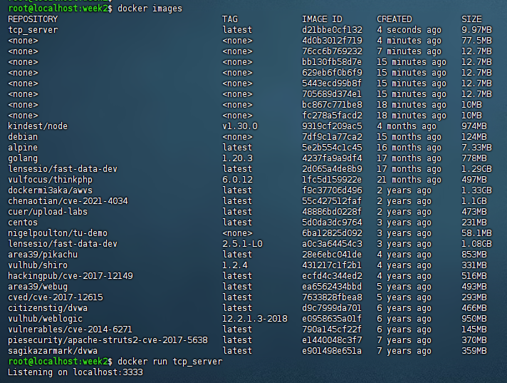
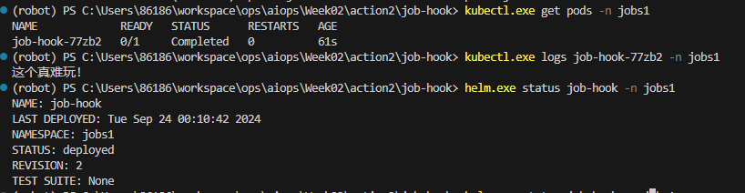
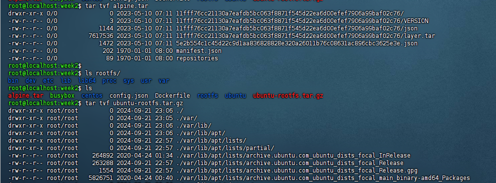

第二周
---

## 实践一

    为这段 Golang 代码写一个多阶段构建的 Dockerfile： https://gist.github.com/abhishekkr/3beebbc1db54b3b54914#file-tcp_server-go

   

   [dockerfile在这里](./action1/Dockerfile)

   https://github.com/krallin/tini


## 实践二

    为 Helm Demo 增加 Pre-install Hooks（Job 类型），并打印一段内容。

   [hook chart在这里](./action2/job-hook/values.yaml)

   


## 实践三

    使用runc启动一个容器

    前提是需要一个rootfs和一个配置，配置文件中需要包含rootfs的路径，配置可以通过runc生成。rootfs需要制作

### 制作rootfs
    ```
     mkdir rootfs
     mkdir -p rootfs/{bin,etc,lib,lib64,usr/{bin,lib,sbin},var,proc,sys}
     cp /bin/bash rootfs/bin/
     ldd /bin/bash  // 通过ldd找到依赖库，并复制到rootfs/lib64目录下
    ```

    ```
    root@localhost:week2$ tree rootfs
    rootfs
    ├── bin
    │   └── bash
    ├── etc
    ├── lib
    ├── lib64
    │   ├── ld-linux-x86-64.so.2
    │   ├── libc.so.6
    │   ├── libdl.so.2
    │   └── libtinfo.so.5
    ├── proc
    ├── sys
    ├── usr
    │   ├── bin
    │   ├── lib
    │   └── sbin
    └── var
    ```
    
    压缩打包, 尝试是否能通过docker import导入到docker中
    ```
    tar -czvf rootfs.tar.gz -C rootfs .
    docker import rootfs.tar.gz my-images:latest
    docker run -it --rm my-images:latest /bin/bash
    root@localhost:week2$ docker run -it --rm my-images:latest /bin/bash
    bash-4.2# pwd
    /
    bash-4.2# cat
    bash: cat: command not found
    bash-4.2# 
    ```
### 更进一步，使用busybox制作rootfs

busybox是一个集成了一百多个最常用linux命令和工具的软件包，它只需要一个非常小的磁盘空间，可以满足基本的使用需求。

    下载busybox二进制,移到rootfs/bin目录下,对命令进行软连接

    ```for cmd in $(./busybox --list); do ln -s busybox $cmd; done```

    设置基本的配置

    echo "root:x:0:0:root:/root:/bin/busybox" > rootfs/etc/passwd
    echo "root:x:0:" > rootfs/etc/group

    压缩打包, 尝试是否能通过docker import导入到docker中

    ```
    tar -czvf rootfs.tar.gz -C rootfs .
    docker import rootfs.tar.gz my-images2:latest
    docker run -it --rm my-images2:latest /bin/busybox
    root@localhost:week2$ docker run -it --rm my-images2:latest /bin/busybox
    root@localhost:week2$ docker run -it --rm my-images2:latest /bin/bash
    bash-4.2# ls
    bin    dev    etc    lib    lib64  proc   sys    usr    var
    bash-4.2# pwd
    /
    bash-4.2# ls -l
    total 16
    drwxr-xr-x    2 root     root         12288 Sep 21 14:01 bin
    drwxr-xr-x    5 root     root           360 Sep 21 14:38 dev
    drwxr-xr-x    1 root     root            66 Sep 21 14:38 etc
    drwxr-xr-x    2 root     root             6 Sep 21 13:35 lib
    drwxr-xr-x    2 root     root            90 Sep 21 13:41 lib64
    dr-xr-xr-x  180 root     root             0 Sep 21 14:38 proc
    dr-xr-xr-x   13 root     root             0 Jan 23  2024 sys
    drwxr-xr-x    5 root     root            40 Sep 21 13:35 usr
    drwxr-xr-x    2 root     root             6 Sep 21 13:35 var
    bash-4.2# cat /etc/group 
    root:x:0:
    bash-4.2# 
    bash-4.2# cat etc/passwd 
    root:x:0:0:root:/root:/bin/busybox
    bash-4.2# 


### 再进一步，制作ubuntu rootfs

    ``` 
    yum install -y debootstrap 
    debootstrap --arch amd64 focal ubuntu http://archive.ubuntu.com/ubuntu/

    echo "root:x:0:0:root:/root:/bin/bash" > ~/ubuntu/etc/passwd
    echo "root:x:0:" > ~/ubuntu/etc/group

    tar -czvf ubuntu-rootfs.tar.gz -C ubuntu .

    root@localhost:week2$ docker import ubuntu-rootfs.tar.gz  ubuntu:latest
    sha256:58d8be7e71f488c9f1948cd55ae4dbad2dce1b28cc0164005bc6c2b8c482e778


### runc 启动容器

    ```
    runc spec
    runc run busy-container
    ```

## 实践四

   k8s上进行微服务部署


## 疑问

### docker镜像



上述两种包都能导入docker中，但结构不同，docker还可以识别是否压缩，是否是tar包等，是如何实现的？
