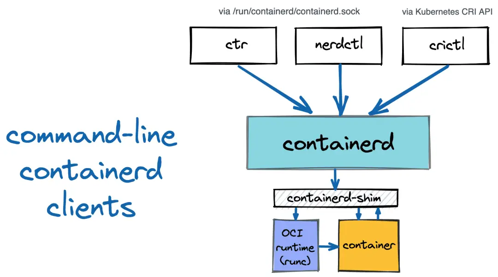
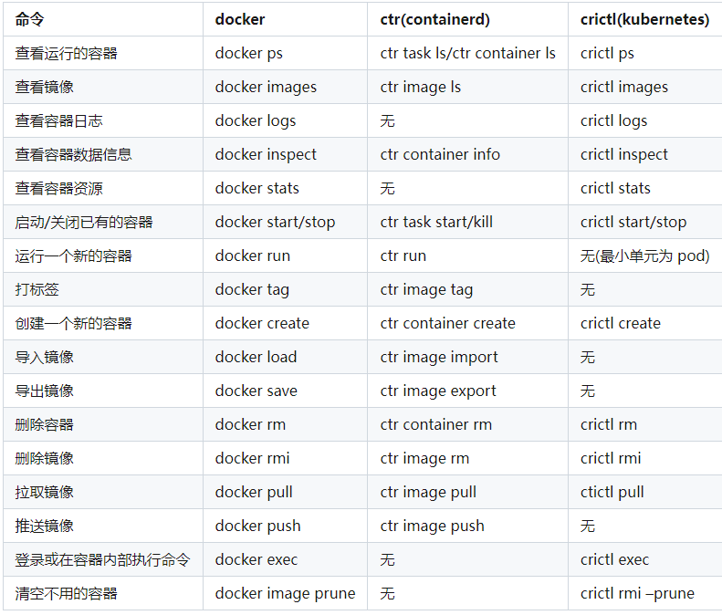

containerd
---

https://www.xiexianbin.cn/container/containerd/index.html

containerd 是一个高级容器运行时，通过守护进程来管理容器的完整生命周期：创建、启动、停止容器、拉取和存储镜像、配置挂载、网络等。

## 简述
docker 在底层使用 containerd 来运行容器
containerd 是从 docker 中拆分出来的。containerd 提供的功能包括：
*  镜像下载
*  镜像管理
*  创建管理容器（调用 Low-Level 的 runc 来完成），当从镜像创建容器时，首先将镜像解开成 OCI runtime bundle，然后调用 runc 来运行容器

### ctr

ctr 是 containerd 项目的一部分，提供的命令行客户端
ctr + containerd 对标 docker + dockerd

### nerdctl
nerdctl 是一个相对较新的 containerd 命令行客户端，目标是促进试验 Docker 中不存在的 containerd 的尖端功能
nerdctl 尝试提供与 docker 相同用户体验的命令行工具

### crictl
crictl 是 Kubernetes CRI 兼容容器运行时的命令行客户端