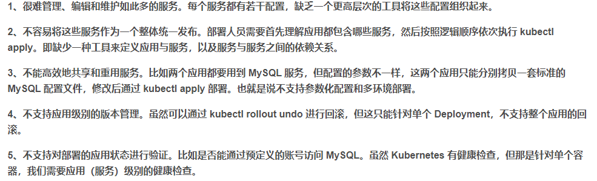

#helm
---

## helm解决了什么问题



helm解决了k8s的配置管理问题，通过模板化，可以方便的部署和管理应用

## helm的重要概念

### chart

 chart是创建一个应用的信息集合，包括配置模块，参数定义，依赖关系，文档说明等。是一个打包好的应用，类似apt,yum中的软件安装包

### release

 release是chart的运行实例, 代表正在运行的应用。一个chart可以被安装多次，在一个k8s集群中，每次安装都会生成一个release


### helm作用

1. 从零创建一个新的chart
2. 与chart仓库进行交互，拉取，保存和更新chart
3. 安装和卸载release到k8s集群中
4. 更新、回滚、测试release

如果使用自定义镜像，则需要先推送镜像到镜像仓库，然后在chart中配置镜像地址。
 

##　创建一个chart

  ```helm create demo```

  * templates目录下有很多yaml文件，这些文件就是k8s的yaml配置文件，通过helm打包后，可以一键部署到k8s集群中
  * chart.yaml文件是chart的元数据文件，描述了chart的名称、版本、描述信息等
  * values.yaml文件中定义了chart的配置信息，可以用来覆盖chart中的默认配置
  * charts目录下定义了chart的依赖，可以用来引入其他chart
    例如：
    ```yaml
          dependencies:
            - name: mariadb
              version: 8.0.26
              repository: https://charts.bitnami.com/bitnami
              condition: mariadb.enabled
              tags:
                - database
                - mysql
                - relational
    ```

    values.yml和chart.yaml定义值，在values.yaml中定义的值，可以在模版中引用，例如：

    ```yaml
      mariadb:
        enabled: true
        image:
          repository: bitnami/mariadb
          tag: 10.8.1-debian-10-r0
          pullPolicy: IfNotPresent
    ```

    ```yaml
      mariadb:
        enabled: {{ .Values.mariadb.enabled }}
        image:
          repository: {{ .Values.mariadb.image.repository }}
          tag: {{ .Values.mariadb.image.tag }}
          pullPolicy: {{ .Values.mariadb.image.pullPolicy }}
    ```

    charts目录中存储依赖的子chart，例如：
    ```
    apiVersion: v2
    name: my-chart
    description: A Helm chart for Kubernetes
    version: 0.1.0

    dependencies:
      - name: dependency-chart-1
        version: 1.0.0
        repository: "https://example.com/charts"
      - name: dependency-chart-2
        version: 2.0.0
        repository: "https://example.org/charts"
    ```

    执行 helm dependency update 更新依赖,会将子chart依赖下载到charts目录


## 调试template

  helm template命令可以用来调试template，将template渲染成yaml文件

  helm template .

## 安装chart

  helm install nginx . -n nginx --create-namespace --set image.tag="latest"


## 更新或安装

  helm upgrade --install nginx . -n nginx --create-namespace --set image.tag="latest"

## 卸载chart

  helm uninstall demo
