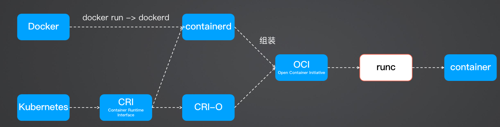

# 笔记
---

云架构知识学习  aws云架构师


##　镜像构建、DinD、buildkit

docker run -v /var/run/docker.sock:/var/run/docker.sock -it docker


buildctl build \
--frontend=dockerfile.v0 \
--local context=. \
--local dockerfile=. \
--output type=image,name=app:latest

 https://github.com/moby/buildkit    容器中直接build镜像


 https://github.com/GoogleContainerTools/kaniko


## docker containerd cri-o runc




docker直接调用containerd,通过oci标准调用runc,k8s通过cri交互标准，使用containerd或者cri-o,再通过oci标准调用runc


## 微服务启动控制
 kubectl.exe logs  result-59998b6b57-9m64g -c wait-for-db  // -c指定容器

 通过k8s-wait-for控制启动顺序
 redis -> postgres -> worker -> vote -> result

##　微服务数据库表的初始化

 * 业务代码初始
 * k8s job初始化
    通过 clone sql schema git repository，然后执行 SQL 初始化数据库
    ```
    apiVersion: batch/v1
    kind: Job
    metadata:
      name: db-init-job
    spec:
      template:
        spec:
          containers:
          - name: db-init
            image: alpine/git  # 使用适合的镜像来克隆 Git 仓库
            command: ["/bin/sh", "-c"]
            args:
              - |
                # 克隆 Git 仓库
                git clone https://github.com/yourusername/my-sql-schema-repo.git /tmp/schema
                # 假设你有一个数据库容器在同一网络中
                # 使用 mysql 客户端执行 SQL 脚本
                mysql -h your-database-host -u your-username -p'your-password' < /tmp/schema/init.sql
          restartPolicy: OnFailure
      backoffLimit: 4
    ```

## 销毁cvm环境时，需要先使用卸载helm chart，再删除cvm,否则会报错