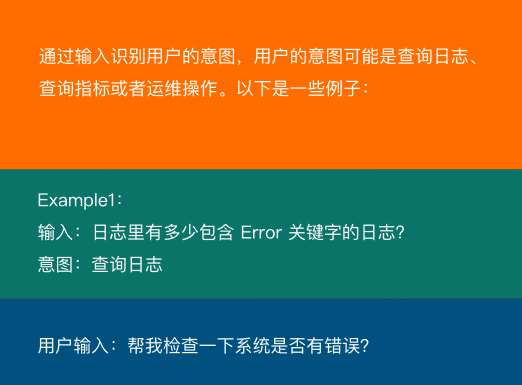
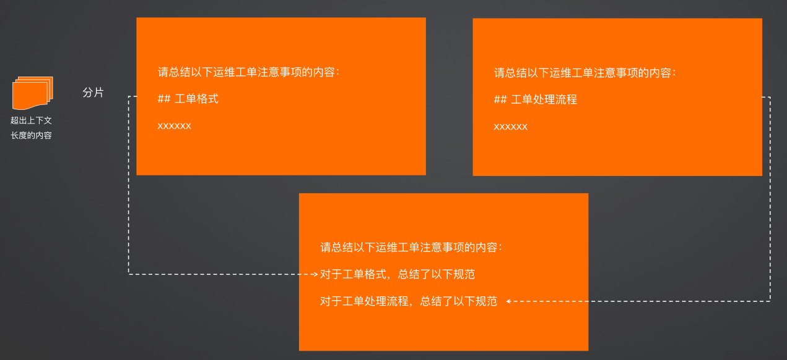

笔记
---


##　ai chat


### 提示工程

名词：prompt engineering = 好的问题 = 好的答案的上下文 = 好的答案
大模型要用的好，需要结合prompt engineering，Prompt决定模型输出质量

• 尽量给出具体的描述，避免说“不要做什么”，而是具体说明“要做什么”
• 对重要事项进行排序
• 标准的格式，例如 markdown 语法
• 拆解任务，给出思路

### 原理

大语言模型通过 Token 来处理文本，模型理解了 Token之间的统计关系，并基于已输出的 Token 计算下一个Token 的概率分布，并选择概率最高的 Token 作为预测结果。

### token
空格也会作为一个token

https://github.com/openai/tiktoken

文本拆分是十分有用的，因为GPT都是以token的形式来阅读文本的。了解文本中的token数量，既可以告诉你字符串是否太长而超出了模型处理能力，也可以查看OpenAI的API费用（按照token计费）。 

编码方案定义了文本是如何转化为token的。不同的模型使用不同的编码。

toktoken支持三种编码，都是OpenAI模型所用的。

你可以像下面这样使用tiktoken.encoding_for_model()来查询某个模型使用的编码。

encoding = tiktoken.encoding_for_model('gpt-3.5-turbo')

### 模型的上下文长度

• Token 的输入（上下文窗口）和输出都是有限的
• 不同模型的限制不同
• Token 越大，可输入的内容越多
• 模型回答效果并不会随着输入 Token 数量线性增长，可能会有相反作用


### 领域术语

#### Zero-shot  
 模型单纯通过自然语言描述任务来回答问题

#### Few-shot
 除了自然语言描述以外，再给模型一些例子参考
 

#### 思维链 Prompt(Cot)

让模型做出一步一步的思考，生成更具备解释性的答案，一般来说可以提高问题的准确率，对于 Zero-shot 和 Few-shot 均有效

#### Generate Knowledge Prompting

在上下文中提供额外的知识来改善推理结果，比如把运维专家知识库的部分内容放在 system prompt 中进行问答

```
你现在是一名运维专家，请根据以下运维专家知识库对故障作出解释
和提出修复建议。
专家知识库内容如下：
```


#### 对于长文本的处理

由于token长度限制，对于长文本，需要拆分处理，比如拆分成多个prompt，进行分片总结，然后汇总后再进行总结




### langchain memory的使用


### JSON Mode 无法实现复杂的业务逻辑，需要结合function calling实现复杂的业务逻辑


### fine-tuning


微调通过喂给大模型更多的样本数据来改进模型的表现，使其在一些特定的任务上输出更好的结果。


### RAG

将私有知识库引入 LLM 的过程称为检索增强生成 (RAG)

步骤：
1. 索引-对私有知识库建立索引，包含加载知识库、拆分、向量化和存储过程
    1. 为了清楚“哪段知识可以解答用户提问”
2. 检索和生成-从私有知识库中查询有关信息，并传递给模型进行对话
    1. 为了提取“可以解答用户提问的知识内容

####　缺点

1. 由于文本分片会把上下文逻辑截断，可能导致无法回答内在逻辑关联的问题
2. 只能回答显式检索问题，无法回答全局性/总结性问题，例如：“谁维护的服务最多？”

### Graph RAG

• 由微软提出的一种全新的方法（https://arxiv.org/pdf/2404.16130）
• 借助 LLM 提取知识库内部实体之间的关系，并构建出知识图谱
• 基于知识图谱进行问答，提供全局性问题的答案

### 部署大模型
https://github.com/ollama/ollama

https://ollama.com/library