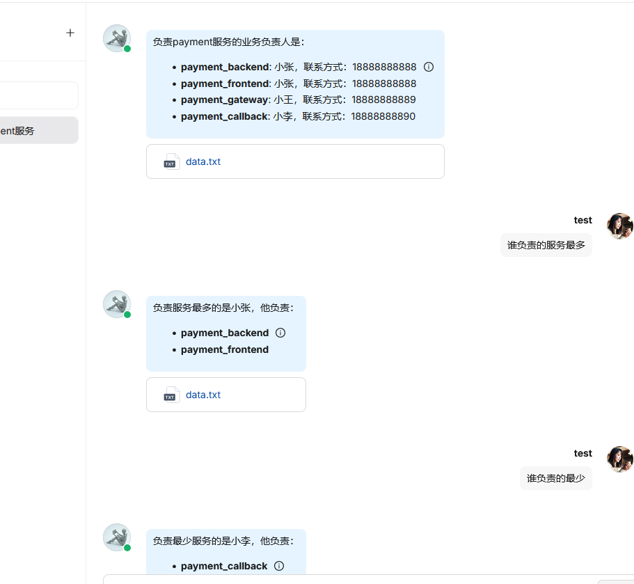
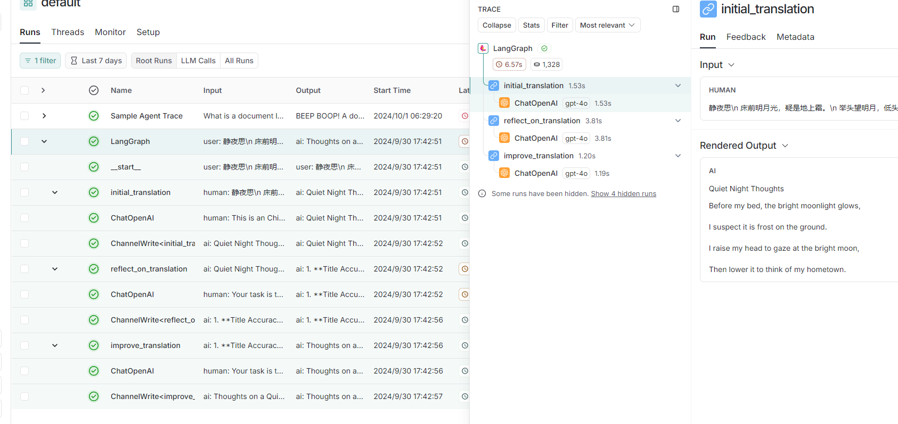
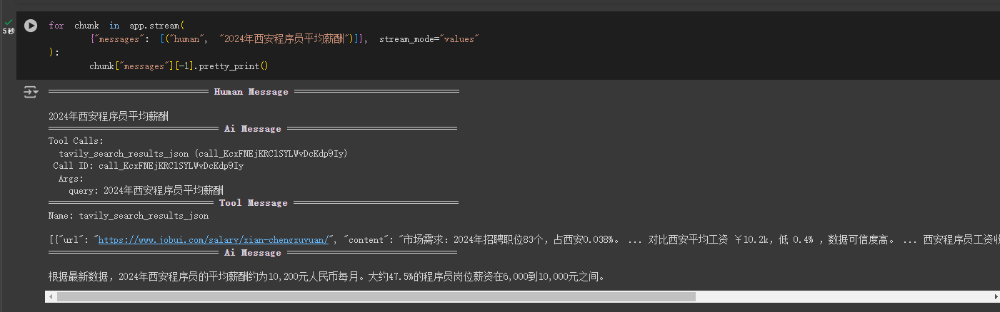

第四周
---

## agent四种设计模式

   * 反馈
   * 工具调用
   * 规划
   * 多智能体协作

## 实践一

    用 [Coze](https://www.coze.com/) 实现个人运维知识库，并分享链接

    https://www.coze.com/store/bot/7420387611170783250?bot_id=true

## 实践二

    部署 RAGFlow，实现内部运维知识库

  ragflow实践, 开启ragflow需要的环境4核，16G，.env中需要改版本为0.9.0，默认的实践时有问题
  

## 实践三

   基于反馈的agent实现一个简单的运维知识库

   1. 文本切割，向量化，存入向量数据库chroma
   2. 构造提示词，由llm判断是否能回答问题
   3. 如果不能，则从知识库中查询相关内容，再由llm判断是否能回答(每次不能回答时，多查询一块，由数量限制)
   4. 如果能，则基于查询得到的上下文，和问题构造提示词，由llm最终回答问题

## 实践四

  基于反馈的agent实现中翻英，以及利用smith进行调试

  [代码在这里](action1/langGraph实践.ipynb)

  
  
## 实践五

  基于反馈与条件控制的函数调用agent示例

  [代码在这里](action1/react_agent.ipynb)

## 实践六

  web搜索工具tavily示例

  [代码在这里](action1/tavily.ipynb)
  

## 实践七

  自适应rag agent

  [自适应rag](action1/自适应rag.ipynb)

  实践失败：向量数据库中查询出的结果，没有包含问题相关内容，导致无法回答问题
  
  [自适应rag+websearch](./action1/自适应rag&websearch.ipynb)