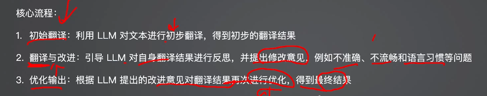
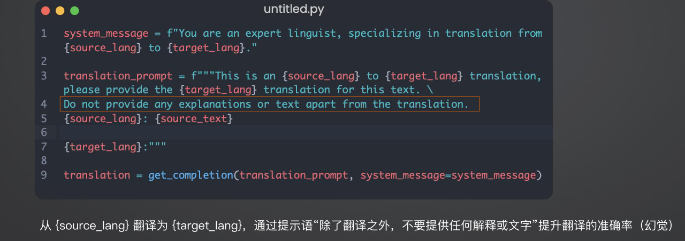
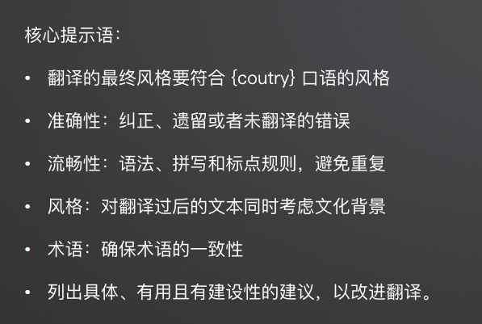
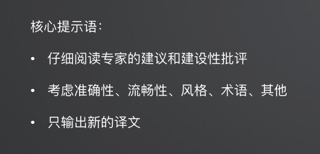
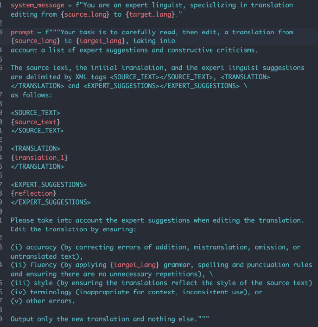
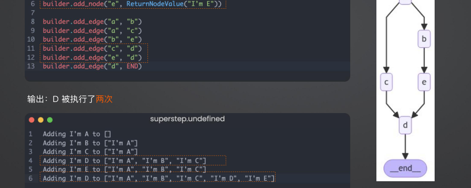
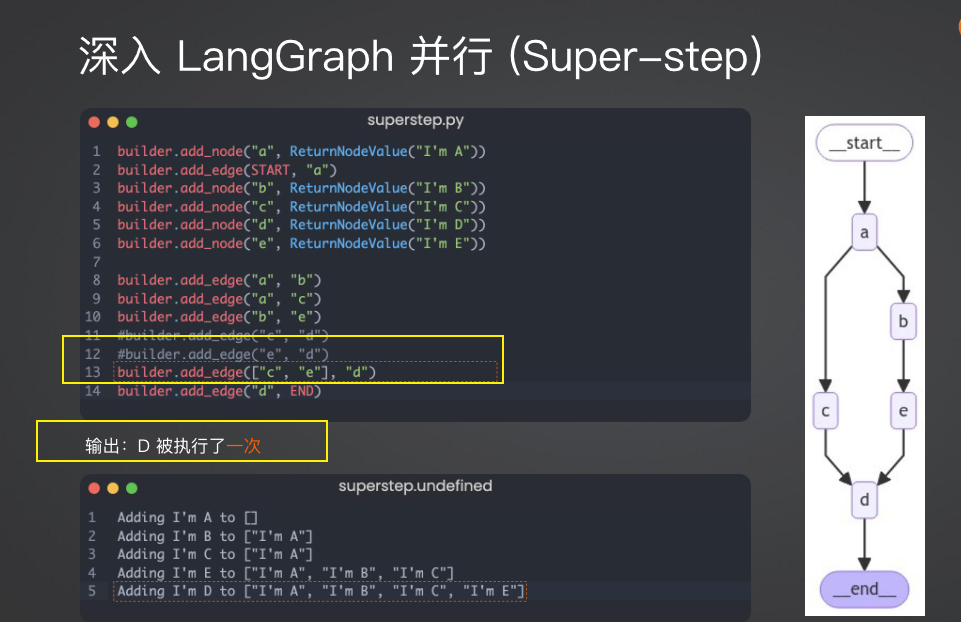
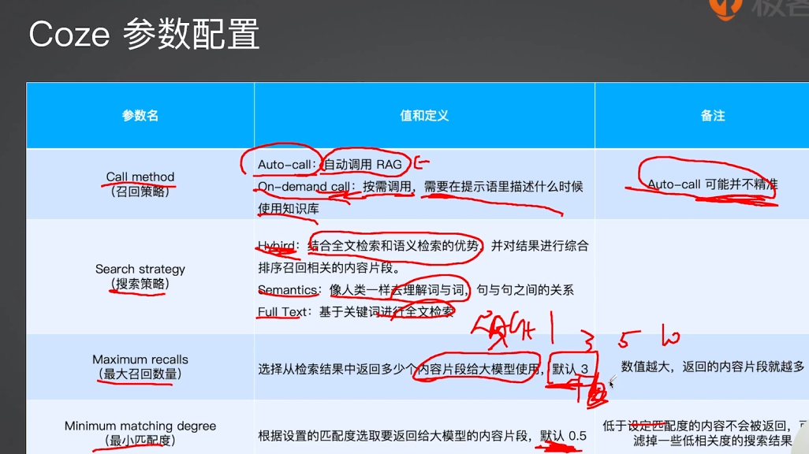
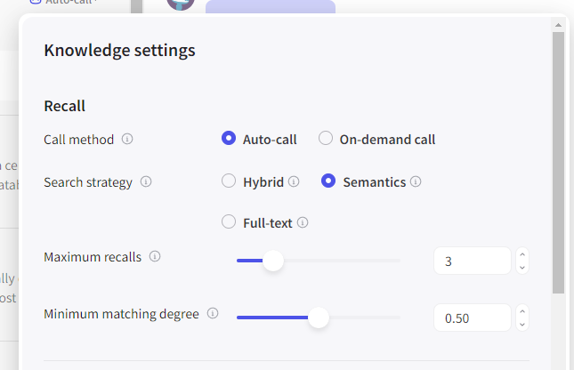

agent
---


## 基于反馈的agent关键点

数据在向量数据库中是分块存储的，每次循环增加一个检索文档的数量，最大为15个

(**可以想象的到，当15个块不足以回答问题的时候，就停止回答。整个过程搜索出来的上下文是循环递增的**)

**依赖llm的智力**


1. 使用query在向量数据库中查询k个相关的文本内容块
2. 填充提示词模板，查询得到的结果作为上下文，query作为问题,构造新的prompt

```
# 提示词模板
    check_can_answer_system_prompt = """
    
    根据上下文识别是否能够回答问题，如果不能，则返回 JSON 字符串 "{"can_answer": false}"，如果可以则返回 "{"can_answer": true}"。
    上下文：\n $context
    问题：$question

"""

    messages = [
        (
            "system",
            filled_prompt,
        ),
        ("human", "开始检查上下文是否足够回答问题。"),
    ]
```
3. 使用模型生成回答，判断是否能够回答问题
4. 如果不能回答，则使用query在向量数据库中查询k个相关的文本内容块，重复步骤2-4
5. 构造最终的提示词模板
```
final_system_prompt = """
您是问答任务的助手，使用检索到的上下文来回答用户提出的问题。如果你不知道答案，就说不知道。最多使用三句话并保持答案简洁。
"""

final_messages = [
    (
        "system",
        final_system_prompt,
    ),
    ("human", "上下文：\n"+ docs +"\n问题：" + user_query),
]
```


### 基于反思工作流的智能翻译agent





* 初始翻译



* 结果反思：

对初始翻译结果进行反思，让LLM 给出优化建议


* 结果改进：





优势：
1. 基于反思工作流，翻译效果优于普通翻译工具
2. 可定制化

不足
1. 翻译效果依赖于 LLM 的智力
2. 相比较商业翻译引擎在特定专业领域略显不足
3. 使用有一定的门槛
4. 基于固定流程，没有使用 Agent 自我思考的循环机制


### langGraph

LangGraph 是一个构建在 LangChain 之上的库，旨在为 Agent 添加循环运算的能力。

LangGraph = 构建 Agent 的框架
```python
class State(TypedDict): 
  messages: Annotated[list, add_messages]

def chat(state: State):
  return {"messages": [llm.invoke(state["messages"])]}

workflow = StateGraph(State)
workflow.add_node(chat)
workflow.set_entry_point("chat")
workflow.set_finish_point("chat")
graph = workflow.compile()

display(Image(graph.get_graph().draw_mermaid_png()))
while True:
  user_input = input("User: ")
  if user_input.lower() in ["quit","q","exit"]:
    print("Goodbye!")
    break
  for event in graph.stream({"messages":("user", user_input)}):
    for value in event.values():
      print("Assistant:", value["messages"][-1].content)
```


https://smith.langchain.com/


#### 如何控制循环结束？

结合条件判断的工具调用工作流
```python
def should_continue(state: MessagesState) -> Literal["tools", "__end__"]:
    messages = state["messages"]
    last_message = messages[-1]
    if last_message.tool_calls:
        return "tools"
    return "__end__"

tool_node = ToolNode(tools)
workflow = StateGraph(MessagesState)
workflow.add_node("chat", call_model)
workflow.add_node("tools", tool_node)

workflow.add_edge("__start__", "chat")
workflow.add_conditional_edges(    ## 条件判断
    "chat",
    should_continue,
)
workflow.add_edge("tools", "chat")
app = workflow.compile()
```

#### 深入 LangGraph 并行 (Super-step)






Checkpointer

LangGraph有一个内置的持久化层，通过checkpointers实现。当你在图中使用checkpointer时，你可以与图形的状态进行交互。当你在图中使用checkpointer时，你可以与图形的状态进行交互并管理它。checkpointer在每个超级步骤中保存图形状态的检查点，从而启用多个强大功能：

首先，checkpointers通过允许人类在任何时间点查看状态并在图形执行后恢复来实现人类参与的工作流。

其次，它允许交互之间的“记忆”。你可以使用checkpointers创建线程，并在图形执行后保存线程的状态。在重复的人工交互（如对话）情况下，任何后续消息都可以发送到该检查点，该检查点将保留以前的消息。

请查看此指南以了解如何将checkpointer添加到图中。

### coze

https://www.coze.com/

coze参数说明






### web搜索 tavily

特点：
• 快速响应：相比较搜索引擎能更快返回结果
• 良好摘要：无需加载页面的所有内容
• 结果优化：针对 LLM 优化的搜索结果，提高准确率
• SaaS 服务，需申请 Key: https://app.tavily.com


### langgraph自适应rag agent

https://arxiv.org/abs/2403.14403

核心点：
• Web 搜索工具：针对近期事件的搜索
• 自适应 RAG 工具：针对知识库相关问题
• 路由器：判断问题交由 Web 搜索还是RAG 处理

https://arxiv.org/abs/2310.11511

特点：
• 对检索到的文档和生成的回答进行反思
和评分，直到获得满意的回答
• 解决传统 RAG 粗暴检索固定数量段落
以及回复准确性差的问题
• 显著提升长文本检索的准确性