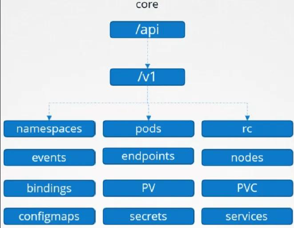
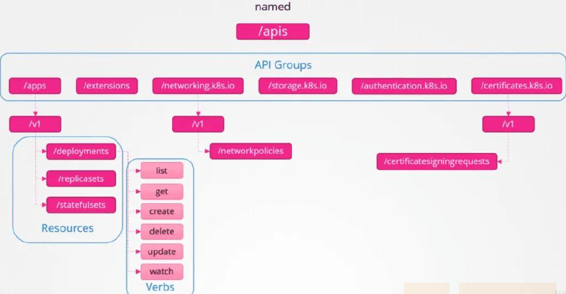

# 笔记记录
---

## 一、client-go是什么
 Client-go 是 Kubernetes 官方提供的 Go 语言的客户端库， 使用该库可以访问 Kubernetes API Server，实现对 Kubernetes 资源（包括 CRD）的增删改查操作。

## 二、k8s的api有哪些
   K8s API 分为核心 API 和命名 API 组，对资源的增删改查可以理解为是对 K8s API 的请求
Client-go 封装了请求 API 所需的鉴权、请求参数以及将返回 JSON 转化为 Go 结构体（Unmarshaling）

* 核心api
  包括 namespace、 service、pods、nodes、configmap、secrets、pv 等对象

* 命名api
  包括 apps/v1/deployments、 apps/v1/replicasets 等对象

## 三、client-go有四种client

 * ClientSet
 * DynamicClient
 * DiscoveryClient
 * RESTClient

 前三种都是基于restclient实现, restclient访问apiserver
