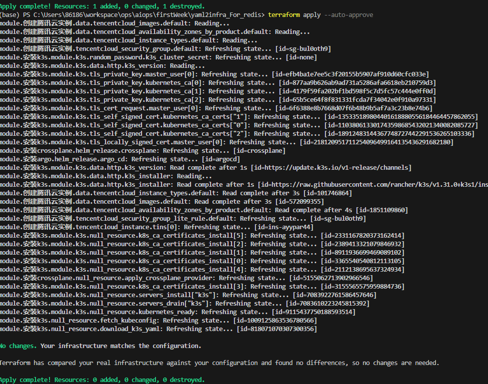
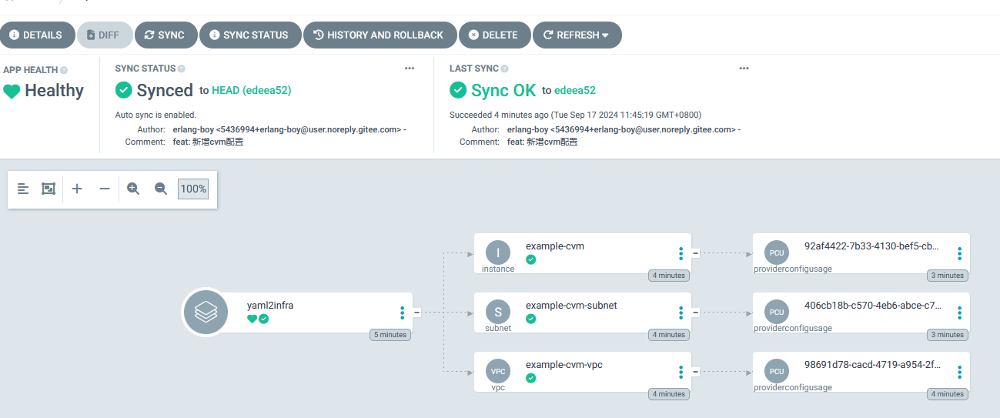
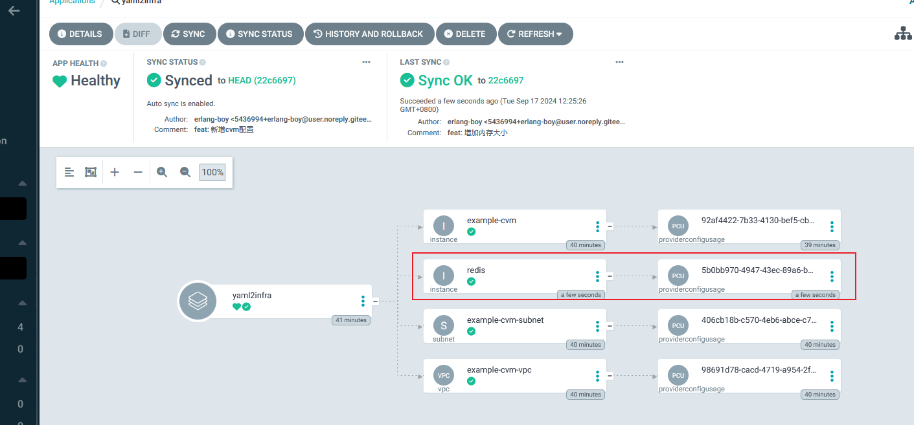

terraform
---


## 1. 实践一
实践 Terraform，开通腾讯云虚拟机，并安装 Docker。


## 2. 实践二
使用 YAML to Infra 模式创建云 Redis 数据库。

    1. 安装环境
   

    2. 配置argo-cd

    3.拿到argocd的密码

    ```kubectl -n argocd get secret argocd-initial-admin-secret -o jsonpath="{.data.password}" | base64 -d```

    4.做端口转发

    ```kubectl port-forward svc/argocd-server -n argocd 8080:80```

    5. 验证示例
   

    6. 创建云redis
   

   